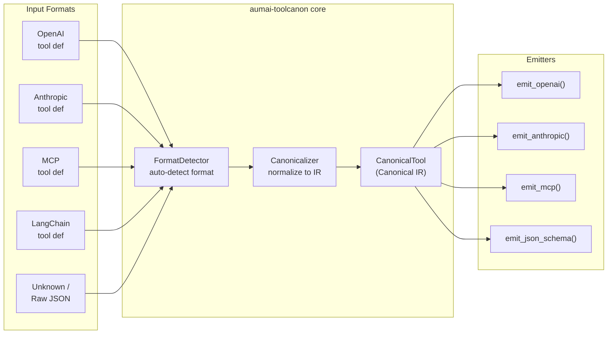

# aumai-toolcanon

> Normalize tool definitions across formats to the AumAI Tool Canonical IR.

[](https://github.com/aumai/aumai-toolcanon/actions)
[](https://pypi.org/project/aumai-toolcanon/)
[](https://www.python.org/)
[](LICENSE)
[](https://github.com/aumai)

---

## What is this?

Imagine you run a large kitchen with four chefs. Each chef writes their recipes in a different notation — one uses metric measurements, another uses imperial, a third uses fractions, and the fourth just writes "a handful of this and a pinch of that." Every time you want to share a recipe or plug it into the central cookbook system, someone has to manually translate it first.

**aumai-toolcanon** is the translator for AI tools.

Modern AI systems define tools (functions an agent can call) in at least four different formats: OpenAI's function calling format, Anthropic's tool format, the Model Context Protocol (MCP), and LangChain's tool schema. If you build an agent platform that supports more than one provider — or that needs to store tools independently of any provider — you deal with all four formats simultaneously.

aumai-toolcanon reads any of those four formats and converts it into a single, unified representation called the **Canonical IR** (Intermediate Representation). Once your tool is in Canonical IR, you can:

- Store it in a tool registry independently of any AI provider
- Emit it back to any target format you need downstream
- Attach rich metadata: capability semantics, security classification, cost estimates
- Audit what your tools actually do before deploying them
- Detect ambiguous or malformed tool definitions before they cause runtime failures

Think of Canonical IR like the common intermediate format in a compiler pipeline: source code in any language compiles to IR, and IR compiles to any target. Tools go in, a clean standard representation comes out, and that representation can be converted back to any provider format on demand.

---

## Why does this matter?

### The problem from first principles

An AI agent's power comes from its tools. A tool is ultimately just a JSON blob that says: "here is a callable function, here is what it accepts, here is what it does." But every AI provider independently invented their own JSON structure for expressing that same concept:

| Provider   | Schema key     | Wrapper structure |
|------------|----------------|-------------------|
| OpenAI     | `parameters`   | `{"type":"function","function":{...}}` |
| Anthropic  | `input_schema` | none (flat object) |
| MCP        | `inputSchema`  | none (flat object) |
| LangChain  | `args_schema`  | varies by tool class |

A tool catalog that works with all four providers must either:

1. Store four copies of every tool definition and keep them all in sync — a maintenance nightmare that multiplies every time a new provider emerges, or
2. Store one canonical representation and translate on the fly — which is exactly what aumai-toolcanon does.

Beyond translation, the canonical format adds semantic information that raw provider formats completely omit: whether a tool has side effects, what domain it operates in, what data classification its outputs carry. This metadata enables policy enforcement, access control, cost gating, and auditability at the tool layer — none of which are possible if you only have the raw provider blob.

---

## Architecture



The core pipeline has three stages:

1. **Detect** — `FormatDetector` examines structural signals in the input dict (which keys are present, nesting shape) and returns the most likely `SourceFormat` along with per-format confidence scores.
2. **Parse** — `Canonicalizer` delegates to the appropriate format-specific parser (`OpenAIParser`, `AnthropicParser`, `MCPParser`, or `LangChainParser`). Each parser extracts name, description, and input schema, and heuristically infers capability metadata from the tool's text fields.
3. **Emit** — Four pure emitter functions convert a `CanonicalTool` back to any supported output format.

---

## Features

| Feature | Description |
|---------|-------------|
| Auto-detection | Identifies OpenAI, Anthropic, MCP, and LangChain formats from structural signals — no hints required |
| Confidence scoring | Returns per-format confidence scores (0–1) for ambiguous or multi-signal inputs |
| Capability inference | Heuristically infers action verb, domain, side effects, and idempotency from tool name and description |
| Security metadata | Attach permission requirements, data classification, and PII handling notes to any tool |
| Bidirectional | Parse any format into canonical IR, then emit to any target format |
| JSON Schema export | Emit a standalone JSON Schema Draft 2019-09 document with capability and security extensions |
| Pydantic v2 validation | All models are validated at construction time — invalid structures fail fast |
| Parser fault tolerance | Parser errors surface as warnings rather than exceptions, enabling graceful degradation |
| CLI included | `toolcanon canonicalize`, `toolcanon emit`, and `toolcanon detect` commands ready out of the box |

---

## Quick Start

### Install

```bash
pip install aumai-toolcanon
```

### Your first canonicalization (under 5 minutes)

Create a file `my_tool.json` with an OpenAI-format tool definition:

```json
{
  "type": "function",
  "function": {
    "name": "search_web",
    "description": "Search the web for a query string",
    "parameters": {
      "type": "object",
      "properties": {
        "query": {
          "type": "string",
          "description": "The search query"
        }
      },
      "required": ["query"]
    }
  }
}
```

Run the CLI:

```bash
toolcanon canonicalize --input my_tool.json
```

You will see the Canonical IR on stdout:

```json
{
  "name": "search_web",
  "version": "1.0.0",
  "description": "Search the web for a query string",
  "capabilities": {
    "action": "search",
    "domain": "web",
    "side_effects": false,
    "idempotent": true,
    "cost_estimate": "unknown"
  },
  "inputs": {
    "type": "object",
    "properties": {
      "query": { "type": "string", "description": "The search query" }
    },
    "required": ["query"]
  },
  "outputs": {},
  "security": null,
  "source_format": "openai",
  "original_definition": { "..." : "..." }
}
```

Now emit it as an Anthropic tool:

```bash
toolcanon canonicalize --input my_tool.json --output canonical.json
toolcanon emit --input canonical.json --target anthropic
```

---

## CLI Reference

All commands live under the `toolcanon` entry point.

### `toolcanon canonicalize`

Convert any supported tool definition into canonical IR.

```
Usage: toolcanon canonicalize [OPTIONS]

Options:
  --input PATH           JSON file containing the tool definition.  [required]
  --source-format TEXT   Force a specific source format: openai, anthropic,
                         mcp, langchain, raw.  Auto-detected if omitted.
  --output PATH          Write canonical JSON to this file.  Default: stdout.
  --version              Show version and exit.
  --help                 Show help and exit.
```

**Examples:**

```bash
# Auto-detect format and print to stdout
toolcanon canonicalize --input tool.json

# Force Anthropic format (skips detection)
toolcanon canonicalize --input tool.json --source-format anthropic

# Save canonical IR to a file
toolcanon canonicalize --input tool.json --output canonical.json
```

Warnings about quality issues (missing name, missing description) are printed to stderr and do not affect the exit code.

---

### `toolcanon emit`

Convert a `CanonicalTool` JSON file back to a provider-specific format.

```
Usage: toolcanon emit [OPTIONS]

Options:
  --input PATH     JSON file containing a CanonicalTool.  [required]
  --target TEXT    Target output format: openai, anthropic, mcp,
                   json-schema.  [required]
  --output PATH    Write emitted JSON to file.  Default: stdout.
  --help           Show help and exit.
```

**Examples:**

```bash
# Emit to MCP format
toolcanon emit --input canonical.json --target mcp

# Emit to OpenAI format and save
toolcanon emit --input canonical.json --target openai --output openai_tool.json

# Emit as standalone JSON Schema (includes x-capabilities and x-security extensions)
toolcanon emit --input canonical.json --target json-schema
```

---

### `toolcanon detect`

Inspect a tool definition file and report its most likely source format.

```
Usage: toolcanon detect [OPTIONS]

Options:
  --input PATH     JSON file containing the tool definition.  [required]
  --verbose        Show confidence scores for all formats.
  --help           Show help and exit.
```

**Examples:**

```bash
# Simple detection
toolcanon detect --input tool.json
# Output: Detected format: openai

# With per-format confidence breakdown
toolcanon detect --input tool.json --verbose
# Detected format: openai
#
# Confidence scores:
#   openai      : 100%
#   anthropic   :   0%
#   mcp         :   0%
#   langchain   :   0%
#   raw         :  10%
```

---

## Python API Examples

### Basic canonicalization

```python
from aumai_toolcanon.core import Canonicalizer

anthropic_tool = {
    "name": "read_file",
    "description": "Read the contents of a file at the given path",
    "input_schema": {
        "type": "object",
        "properties": {
            "path": {"type": "string", "description": "Absolute file path"}
        },
        "required": ["path"]
    }
}

canon = Canonicalizer()
result = canon.canonicalize(anthropic_tool)

print(result.source_format_detected)    # SourceFormat.anthropic
print(result.tool.name)                 # "read_file"
print(result.tool.capabilities.action)  # "read"
print(result.tool.capabilities.domain)  # "filesystem"
print(result.warnings)                  # []
```

### Forcing a specific source format

```python
from aumai_toolcanon.models import SourceFormat

result = canon.canonicalize(tool_def, source_format=SourceFormat.mcp)
```

### Checking confidence scores

```python
from aumai_toolcanon.core import FormatDetector

detector = FormatDetector()
scores = detector.confidence(tool_def)

for fmt, score in sorted(scores.items(), key=lambda x: -x[1]):
    print(f"{fmt.value:12s}: {score:.0%}")
```

### Emitting to provider formats

```python
from aumai_toolcanon.emitter import emit_openai, emit_anthropic, emit_mcp, emit_json_schema

tool = result.tool

openai_def    = emit_openai(tool)
anthropic_def = emit_anthropic(tool)
mcp_def       = emit_mcp(tool)
json_schema   = emit_json_schema(tool)
```

### Adding security metadata manually

```python
from aumai_toolcanon.models import CanonicalTool, ToolCapability, ToolSecurity, SourceFormat

tool = CanonicalTool(
    name="delete_record",
    description="Permanently delete a database record by ID",
    capabilities=ToolCapability(
        action="delete",
        domain="database",
        side_effects=True,
        idempotent=False,
        cost_estimate="low",
    ),
    security=ToolSecurity(
        required_permissions=["db:write", "records:delete"],
        data_classification="confidential",
        pii_handling="processes",
    ),
    inputs={
        "type": "object",
        "properties": {
            "record_id": {"type": "string", "description": "Record primary key"}
        },
        "required": ["record_id"]
    },
    source_format=SourceFormat.raw,
)

# JSON Schema output embeds security metadata as x-security extension
schema = emit_json_schema(tool)
print(schema["x-security"]["data_classification"])  # "confidential"
```

---

## Configuration Options

### CanonicalTool fields

| Field | Type | Default | Description |
|-------|------|---------|-------------|
| `name` | `str` | required | Normalized tool name |
| `version` | `str` | `"1.0.0"` | Tool version string |
| `description` | `str` | `""` | Human-readable description |
| `capabilities` | `ToolCapability` | auto-inferred | Semantic capability metadata |
| `inputs` | `dict` | `{}` | JSON Schema object describing inputs |
| `outputs` | `dict` | `{}` | JSON Schema object describing outputs |
| `security` | `ToolSecurity \| None` | `None` | Security and data handling metadata |
| `source_format` | `SourceFormat` | `raw` | Origin format identifier |
| `original_definition` | `dict` | `{}` | Preserved copy of the original input |

### ToolCapability fields

| Field | Type | Default | Description |
|-------|------|---------|-------------|
| `action` | `str` | `""` | Primary verb: read, write, search, call, delete, etc. |
| `domain` | `str` | `""` | Domain: filesystem, web, database, code, email, general |
| `side_effects` | `bool` | `False` | Whether the tool modifies external state |
| `idempotent` | `bool` | `True` | Whether repeated calls produce identical results |
| `cost_estimate` | `str` | `"unknown"` | Cost category: free, low, medium, high, unknown |

### ToolSecurity fields

| Field | Type | Default | Description |
|-------|------|---------|-------------|
| `required_permissions` | `list[str]` | `[]` | Permission strings required to invoke this tool |
| `data_classification` | `str` | `"public"` | Classification: public, internal, confidential, restricted |
| `pii_handling` | `str` | `"none"` | PII posture: none, processes, stores, anonymizes |

---

## How it works (technical deep-dive)

### Format detection priority

`FormatDetector.detect()` iterates parsers in a fixed priority order and returns the first format whose `can_parse()` method returns `True`:

1. **OpenAI** — `type == "function"` with a `function` sub-key present, OR both `"name"` and `"parameters"` keys exist at top level
2. **Anthropic** — both `"name"` and `"input_schema"` keys exist
3. **MCP** — both `"name"` and `"inputSchema"` keys exist
4. **LangChain** — `"args_schema"` or `"schema"` key present; lower-confidence match on `"properties"` + `"name"`
5. **Raw** — fallback when no parser matches

`confidence()` returns independent float scores for each format, enabling diagnostic tooling and tie-breaking logic. An OpenAI tool with the `type/function` wrapper scores `1.0`; a legacy function call (no wrapper) scores `0.7`.

### Capability inference

Each format-specific parser calls the shared `_infer_capabilities(name, description)` helper. This function:

- Concatenates and lowercases `name + " " + description`
- Scans for side-effect verbs (`write`, `create`, `delete`, `update`, `post`, `send`, `save`, `remove`) — any match sets `side_effects=True` and `action="write"`
- Scans for read verbs (`read`, `get`, `fetch`, `list`, `search`, `query`, `find`) — sets `action` to the matched verb
- Maps domain keywords to canonical domain strings: `"file"` → `filesystem`, `"sql"/"database"` → `database`, `"http"/"api"/"web"/"search"` → `web`, `"code"` → `code`, `"email"` → `email`

Inference is heuristic and intentionally conservative. Override any field by constructing `ToolCapability` explicitly.

### Emitter design

All four emitters are pure functions — they take a `CanonicalTool` and return a `dict`, never mutating the input. The `emit_json_schema` emitter is the richest: it produces a full JSON Schema Draft 2019-09 document and embeds capability metadata under `x-capabilities` and security metadata under `x-security` as vendor-extension properties.

### Error handling strategy

`Canonicalizer.canonicalize()` catches all exceptions from format-specific parsers and falls back to the raw heuristic extractor, appending a descriptive warning to `CanonicalizationResult.warnings`. This means the library never raises on malformed input in production — warnings are surfaced, and a best-effort canonical tool is always returned.

---

## Integration with other AumAI projects

| Project | How it integrates |
|---------|-------------------|
| **aumai-toolregistry** | Uses `CanonicalTool` as the storage format for persisted and versioned tools |
| **aumai-agentruntime** | Queries the registry and emits canonical tools to the correct provider format at agent dispatch time |
| **aumai-conformance** | Validates that MCP tool definitions meet the spec before canonicalization |
| **aumai-modelrouter** | Capability metadata (`cost_estimate`, `side_effects`) can inform routing policy decisions |

Recommended pipeline for multi-provider agent systems:

```
raw tool defs (any format)
    -> aumai-toolcanon   (normalize to Canonical IR)
    -> aumai-toolregistry (persist with versioning and search)
    -> aumai-agentruntime (emit to provider format at dispatch time)
```

---

## Contributing

Contributions are welcome. Please read `CONTRIBUTING.md` before opening a pull request.

To run the test suite:

```bash
pip install -e ".[dev]"
pytest
```

To lint and type-check:

```bash
ruff check src tests
mypy src
```

Commit style: `feat:`, `fix:`, `refactor:`, `docs:`, `test:`, `chore:` (Conventional Commits). Commit messages explain *why*, not *what*.

---

## License

Apache License 2.0 — see [LICENSE](LICENSE).

Copyright (c) 2025 AumAI Contributors.
